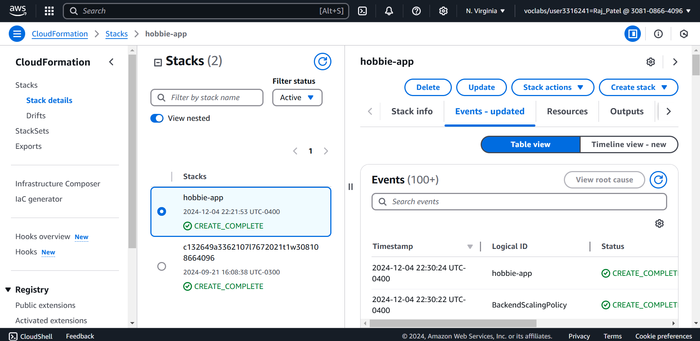
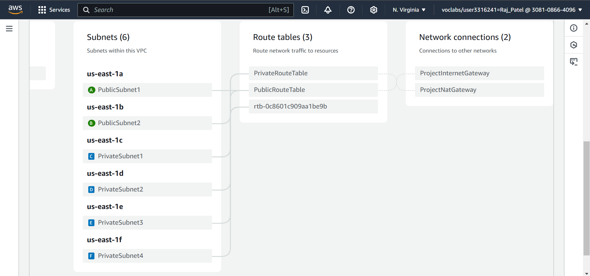
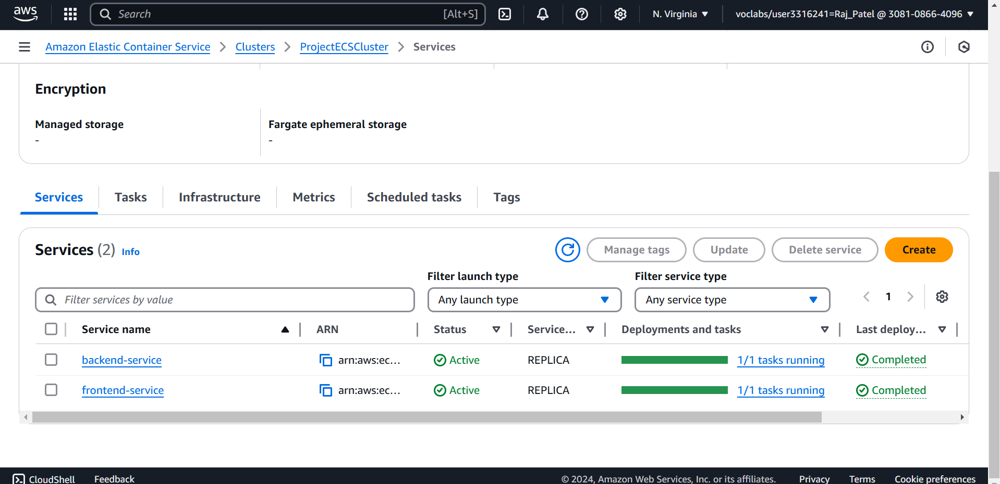
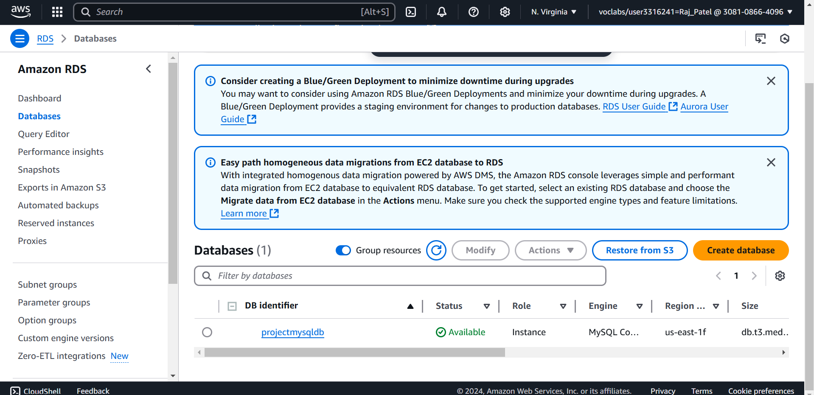
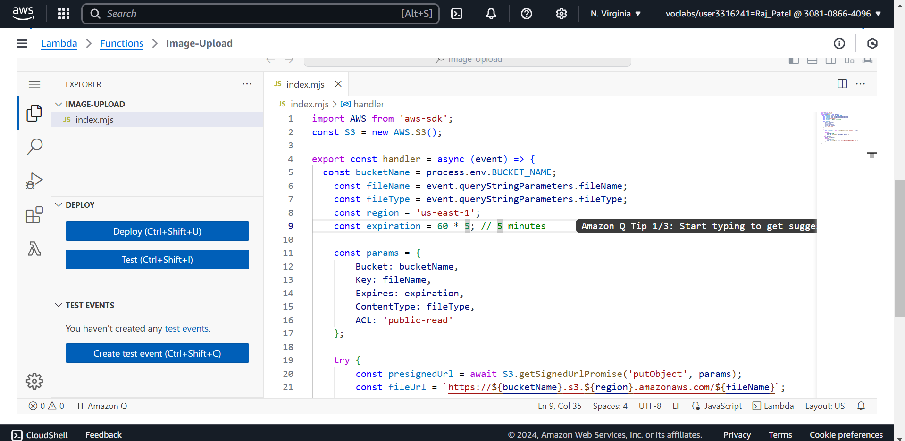
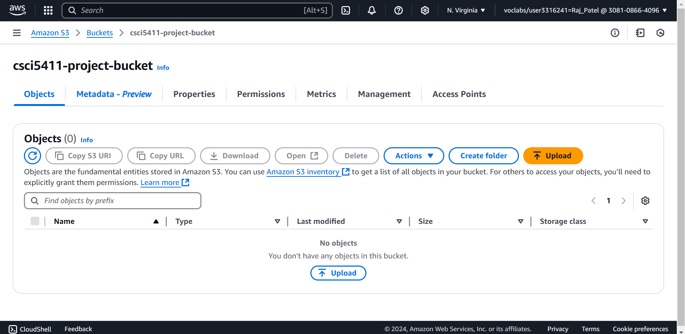
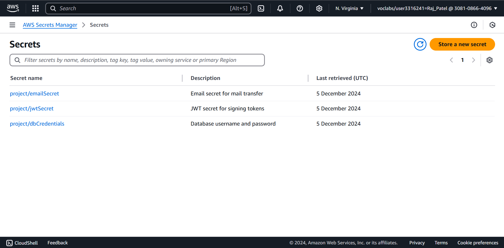

# ReactJS-Spring-Boot-Full-Stack-App (AWS Migration)

This is the same web application but now migrated to the AWS Cloud.

## Code Changes

- **Docker file**:
  - **react-frontend**: building the image using slim image and nginx for faster build
  - **spring-backend**: building the image using jdk 11 and jre 11 slim for faster build
- **Health Check API**: health check api for exposing the backend using Application Load Balancer
- **Page Navigation**: fixed the web page navigation (changed `router.push` with `navigate`)
- **Presigned URL**: added AWS Lambda function call to get the presigned URL for uploading images to Amazon S3 bucket.

## AWS Services Used:

- **Virtual Private Cloud (VPC)**:
  - **2 Public Subnets** for internet access and Application Load Balancer (ALB).
  - **2 Private Subnets** for codebase deployment in Elastic Container Service (ECS), AWS Lambda Function to upload image to Amazon S3 and exposing the web application using Application Load Balancer (ALB).
  - **2 Private Subnets** for Amazon Relational Database (RDS) to store application data.
- **Elastic Container Registry** (ECR):
  - For storing the frontend and backend images.
- **Elastic Computer Service** (ECS - Fargate):
  - For deploying the frontend and backend container for the web application.
- **Application Load Balancer** (ALB):
  - **Port 80** to forward the internet traffic of port 80 to frontend ECS service.
  - **Port 8080** to forward the internet traffic of port 8080 to backend ECS service.
- **Amazon Relational Database Service** (RDS - MySQL):
  - For storing the data.
- **AWS Lambda Function**:
  - For uploading the images using the S3 presigned URL.
- **Amazon S3**:
  - For storing the images uploaded by the web application users.
- **AWS Secrets Manager**:
  - For storing the web application sensitive informations (Database Password, JWT Secret, Email Password).
- **CloudFormation**:
  - For automatic resource allocation using yml script.

## Deployment Screenshots

1. CloudFormation Stack Creation
   

2. Virtual Private Cloud (VPC)
   

3. Elastic Container Service (ECS)
   

4. Application Load Balancer (ALB)
   

5. Amazon Relational Database Service (RDS)
   

6. AWS Lambda Function
   

7. Amazon S3
   

8. AWS Secrets Manager
   
